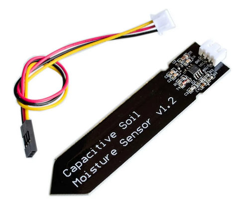
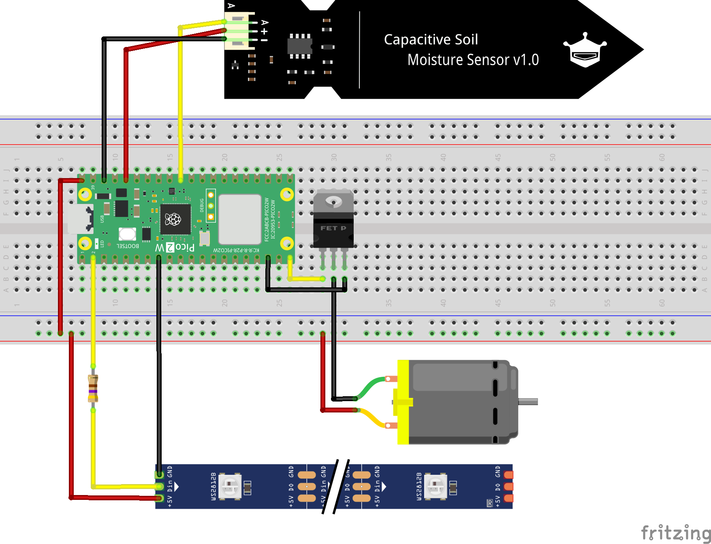

   # Irrigation Workshop

## Introduction
In this workshop, we will build an automated plant watering system. It will consist of four key components:
1. Sensor – measures soil moisture
2. Pump – delivers water to the plant
3. Controller – reads sensor data and controls the pump
4. Interface – let's you control and monitor the system

Together, these parts create a responsive system that waters a plant only when it needs it.

### Soil Moisture Sensors

#### Overview

| Sensor Type      | Measurement Principle                    | Advantages                  | Limitations                                    |
|------------------|------------------------------------------|-----------------------------|------------------------------------------------|
| Capacitive       | Measures dielectric constant of the soil | Durable, accurate           | Sensitive to nearby objects and interference   |
| Resistive        | Measures electrical resistance           | Cheap, easy to use          | Corrodes over time (potentially toxic)         |

In addition to resistive and capacitive sensors, there are more advanced methods used in agriculture and research, such as tensiometers, Time Domain Reflectometry or Frequency Domain Reflectometry TDR/FDR sensors, and thermal or capillary-based systems. These offer higher accuracy or different measurement principles (like soil water tension) but are often more complex or expensive.

#### DIY Sensors

Tension Sensors (e.g. Tensiometer, Capillary Sensor)
- Measure how tightly water is held in the soil.
- Simulate what plants "feel" when extracting water.
- Use porous ceramic tips and water-filled tubes to show suction or pressure changes.
- analog output but requires pressure sensor to read electronically -> fun but complex to integrate.

Resistive Sensors (e.g. Nail Electrodes, Gypsum Block)
- Measure electrical resistance between two conductors.
- Moist soil conducts better, dry soil worse (but soil type/quality has an impact too!).
- Simple to build with nails, wires, or embedded in gypsum for more stability.
- analog output (voltage) which is very easy to read with microcontrollers -> simple and easy to integrate.

Tensiometers provide more biologically meaningful data, but are harder to read electronically. Resistive sensors are easier to connect and automate, making them ideal for basic watering systems.

#### Workshop Sensor Choice
For this workshop I recommend using the an off-the-shelf capacitive sensor. They are are more stable and durable than resistive ones. They don’t corrode as quickly, provide smoother readings, and are widely available as well as affordable. This makes them ideal for beginner projects and long-term use in automated watering systems. There are standard sensors that are sold by various shops (see image below). However, they are often faulty. Check this video before you buy some: [Capacitive Soil Moisture Sensors don't work correctly + Fix for v2.0 v1.2 Arduino ESP32 Raspberry Pi](https://www.youtube.com/watch?app=desktop&v=IGP38bz-K48)



### Pump Systems

| Pump Type         | Working Principle                             | Advantages                        | Suitable For                     |
|-------------------|-----------------------------------------------|-----------------------------------|----------------------------------|
| Submersible Pump  | Impeller submerged in water reservoir         | High flow rate, robust            | Raised beds, greenhouses         |
| Diaphragm Pump    | Oscillating membrane creates pressure/vacuum  | Stable pressure, self-priming     | Distributed watering systems     |
| Peristaltic Pump  | Fluid pushed through flexible tube by rollers | Precise dosage, no backflow       | Potted plants, indoor setups     |

For this workshop, we will use a diaphragm pump. They are reliable, self-priming, and can handle small amounts of water with consistent pressure. They work well in compact systems and are easy to control with a relay or MOSFET. Their sealed design also makes them less prone to leaking or clogging — perfect for small-scale automated irrigation projects.

### Controlling the Pump

Microcontrollers like ESP32 or Arduinos cannot power pumps directly. You need an electronic switch that can handle higher current. There are two common ways to do this: Using a relay or a MOSFET.

| Feature                  | Relay Module                            | MOSFET Module                               |
|--------------------------|-----------------------------------------|---------------------------------------------|
| Switching type           | Mechanical (electromagnetic switch)     | Electronic (transistor-based)               |
| Sound                    | Audible “click” when switching          | Silent                                      |
| Speed                    | Slow switching (ms range)               | Fast switching (μs range), suitable for PWM |
| Load types               | Good for AC and DC                      | Typically used for DC only                  |
| Efficiency               | Some power loss (mechanical contact)    | High efficiency, low heat generation        |
| Use case example         | Simple on/off pump control              | Precise or PWM pump control (e.g. speed)    |
| Complexity               | Easy to wire and understand             | Requires correct polarity and pin setup     |


For this workshop, we will use a MOSFET (IRLB8721PbF). This logic-level MOSFET can be triggered directly from a microcontroller (e.g. Arduino or micro:bit) and is capable of switching up to 24 V DC and 10 A — more than enough for most small pumps or valves. It's silent, efficient, and ideal for low-voltage DC systems.
While the pumps used in this setup typically draw far less current (around 500 mA), using a higher-rated MOSFET gives us more flexibility. It ensures that the same circuit can also be used safely with larger pumps or other components in future projects.

(Wiring example check [here](https://learn.adafruit.com/rgb-led-strips/usage)) 

NOTE: Pico AND MOSFET/Pump Power Source MUST HAVE THE SAME GROUND!!

### Adding an LED strip as part of the interface

As part of this workshop, we held an open design session with some of the participants before the hands-on activities began. One of their suggestions was to add an LED strip with 10 individually controllable LEDs to visualize the soil moisture level.

We use a WS2812B (NeoPixel-compatible) LED strip, which allows for precise color and brightness control using a single data pin from the microcontroller. 


## Setup and Code

### Wiring the components



### Switch GPIO output on and off

```python
import machine
import time

# Set the pump control pin
PUMP_PIN = 15  # Use GPIO15, change if needed
pump = machine.Pin(PUMP_PIN, machine.Pin.OUT)

def pump_on():
    pump.value(1)  # Set pin HIGH to turn pump ON
    print("Pump ON")

def pump_off():
    pump.value(0)  # Set pin LOW to turn pump OFF
    print("Pump OFF")

# Simple test sequence
while True:
    print("Turning pump ON for 3 seconds...")
    pump_on()
    time.sleep(3)
        
    print("Turning pump OFF for 3 seconds...")
    pump_off()
    time.sleep(3)

```

### Reading Sensor Data

```python
from machine import Pin, ADC
from time import sleep

soil = ADC(Pin(26))

while True:
  soil_value = soil.read_u16() # read value, 0-65535 across voltage range 0.0v - 3.3v
  soil_voltage = (soil_value/65535)*3.3
  print(soil_voltage) 
  sleep(1)

```

### Test LED strips

```python

import machine
import neopixel
import time

# Configuration
NUM_LEDS = 10
PIN = 1
BRIGHTNESS = 100  # 0–255

np = neopixel.NeoPixel(machine.Pin(PIN), NUM_LEDS)

# Helper: apply brightness to RGB
def scale_color(r, g, b, brightness):
    factor = brightness / 255
    return int(r * factor), int(g * factor), int(b * factor)

# Helper: turn off all LEDs
def clear_strip():
    for i in range(NUM_LEDS):
        np[i] = (0, 0, 0)
    np.write()

# List of colors to cycle through
colors = [
    (255, 0, 0),   # Red
    (0, 255, 0),   # Green
    (0, 0, 255)    # Blue
]

# Main running light loop
try:
    color_index = 0
    while True:
        r, g, b = colors[color_index]
        r, g, b = scale_color(r, g, b, BRIGHTNESS)

        # Forward direction
        for i in range(NUM_LEDS):
            clear_strip()
            np[i] = (r, g, b)
            np.write()
            time.sleep(0.1)

        # Backward direction
        for i in range(NUM_LEDS - 2, 0, -1):
            clear_strip()
            np[i] = (r, g, b)
            np.write()
            time.sleep(0.1)

        # Next color
        color_index = (color_index + 1) % len(colors)

except KeyboardInterrupt:
    clear_strip()
    print("Running light stopped.")


```

### Test all Hardware

```python
import machine
import neopixel
import time

# === Configuration ===
ADC_PIN = 26               # GP26 = ADC0
NEOPIXEL_PIN = 1           # GP1
NUM_LEDS = 10
BRIGHTNESS = 0.2           # Scale 0–1

PUMP_PIN = 15              # GP15 for pump
MOISTURE_THRESHOLD = 30.0  # in percent
PUMP_DURATION = 1          # in seconds

MAX_VOLTAGE = 3.0          # Voltage at driest
MIN_VOLTAGE = 0.5          # Voltage at wettest

# === Setup ===
adc = machine.ADC(ADC_PIN)
np = neopixel.NeoPixel(machine.Pin(NEOPIXEL_PIN), NUM_LEDS)

pump = machine.Pin(PUMP_PIN, machine.Pin.OUT)
pump.value(0)  # Ensure pump is off

# === Helper Functions ===

def read_voltage():
    raw = adc.read_u16()  # Range: 0–65535
    voltage = (raw / 65535) * 3.3
    return voltage

def map_voltage_to_percent(voltage):
    voltage = max(min(voltage, MAX_VOLTAGE), MIN_VOLTAGE)
    percent = (MAX_VOLTAGE - voltage) / (MAX_VOLTAGE - MIN_VOLTAGE) * 100
    return round(percent, 1)

def get_color(percent):
    if percent <= 30:
        return (255, 0, 0)         # Red
    elif percent <= 50:
        return (255, 180, 0)       # Yellow
    else:
        return (0, 255, 0)         # Green

def show_leds(percent):
    leds_on = round(percent / 100 * NUM_LEDS)
    color = get_color(percent)
    for i in range(NUM_LEDS):
        np[i] = color if i < leds_on else (0, 0, 0)
    np.write()

# === Main Loop ===
COOLDOWN = 5  # seconds to wait before retrying pump

try:
    while True:
        voltage = read_voltage()
        percent = map_voltage_to_percent(voltage)
        print("Moisture: {:.1f}% (Voltage: {:.2f} V)".format(percent, voltage))
        
        show_leds(percent)

        if percent < MOISTURE_THRESHOLD:
            print("Moisture below threshold — starting pump.")
            pump.value(1)
            time.sleep(PUMP_DURATION)
            pump.value(0)
            print("Pump stopped.")
            print("Waiting for moisture to improve...")
            time.sleep(COOLDOWN)
        else:
            time.sleep(1)

except KeyboardInterrupt:
    print("Stopped by user.")
    pump.value(0)
    for i in range(NUM_LEDS):
        np[i] = (0, 0, 0)
    np.write()


```

## Interfaces


## Similar Projects

### Self-Watering Flower Pot "Flaura"
This 3D-printable self-watering flower pot project integrates a soil moisture sensor, a microcontroller (ESP8266), and a small water pump to automate plant care. It also includes a mobile app interface using Blynk, allowing users to monitor soil moisture and trigger manual watering remotely.

https://www.thingiverse.com/thing:4921885


### Watering System without microcontroller
This project builds a simple automatic plant watering system without using a microcontroller. It uses soil probes to detect moisture, a BC547 transistor to trigger a relay, and a small water pump. When the soil is dry, the pump automatically turns on; when the soil is wet, it turns off. It's a low-cost solution with no programming required.

https://circuitdigest.com/electronic-circuits/automatic-plant-watering-system-without-arduino

### Elecrow Smart Plant

A compact IoT plant monitor built around an ESP32‑S2 microcontroller, featuring a built‑in capacitive soil moisture probe, ambient light and air temperature/humidity sensors, and an optional 2.9″ e‑paper display for live data. It streams data over Wi‑Fi (compatible with Home Assistant via ESPHome) and is ideal for visualizing plant health, though it does not include a pump or watering system

https://www.elecrow.com/smart-plant.html
